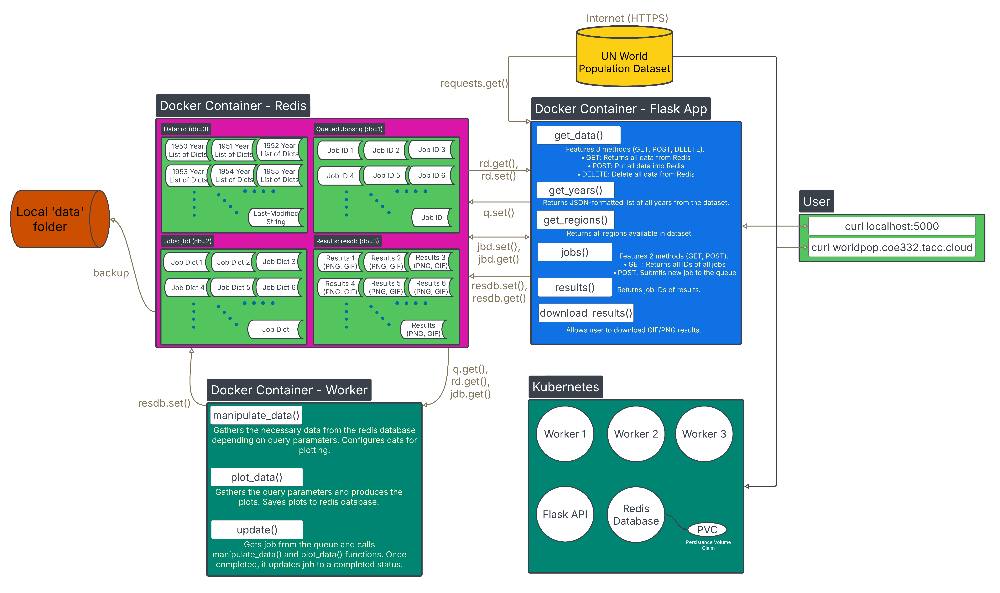
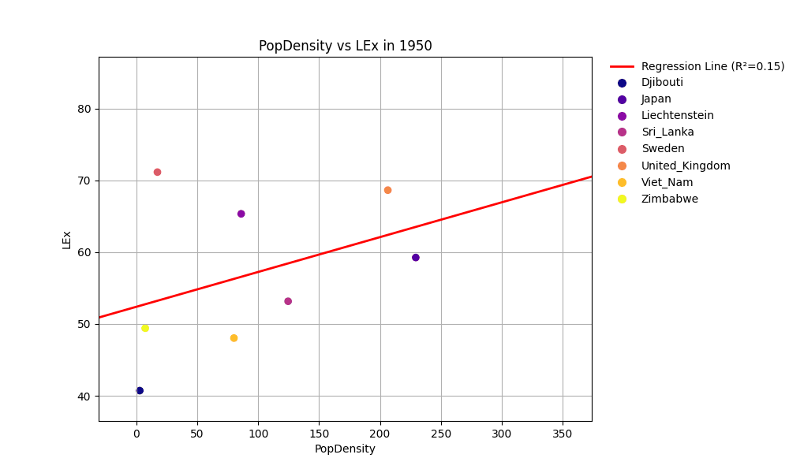

# Earth In Numbers 

## Table of Contents
1. [Description: World Population Flask API with Redis Integration](README.md#description-world-population-flask-api-with-redis-integration) 
2. [Software Diagram](README.md#software-diagram)
2. [World Population Prospects Data Set](README.md#world-population-prospects-data-set)
2. [Getting Started](README.md#getting-started)
3. [Building the Container](README.md#building-the-container)
4. [Running Docker Container](README.md#running-containerized-scripts)
5. [Accessing Microservice](README.md#accessing-microservice)
6. [Running Test Scripts](README.md#running-test-scripts)
5. [Clean Up](README.md#clean-up)
9. [Resources](README.md#resources)
10. [AI Usage](README.md#ai-usage)


## Description: World Population Flask API with Redis Integration

This project features a containerized Flask API that interfaces with a [Redis](https://redis.io) database to manage and serve global population data based on the [UN World Population Prospects 2024 dataset](https://population.un.org/wpp/downloads?folder=Standard%20Projections&group=CSV%20format). The `api.py` script handles the ingestion, caching, and access to this demographic data, stored in Redis as structured `key:value` pairs across separate databases for raw data, job tracking, and processed results.

### API Functionality

The API exposes several routes for interacting with the dataset and managing long-duration queries via a Redis-backed job queue system. 

#### Available Routes

Here is the full list of the available routes and their syntax: 

|  Route                              |  Method  | Functionality                                                                     | 
| ----------------------------------- | -------- | --------------------------------------------------------------------------------- | 
| /data                               | GET      | Put data into Redis                                                               | 
| /data                               | POST     | Return all data from Redis                                                        | 
| /data                               | DELETE   | Delete all data from Redis                                                        | 
| /years                              | GET      | Return json-formatted list of all the years available from the dataset            | 
| /years/{year}/regions               | GET      | Return all data associated with a specific year and all its regions               | 
| /years/{year}/regions?names=a,b,c   | GET      | Return data associated with a specific year and the specified regions             | 
| /regions                            | GET      | Return a list of all regions/countries in the dataset                             | 
| /regions/{region}                   | GET      | Return data of all the years for a specific {region}                              | 
| /regions/{region}/{eras}            | GET      | Return data for a specific region and the specified eras/years                    | 
| /help                               | GET      | Returns instructions to post a job                                                | 
| /jobs                               | GET      | Return a list of all job IDs                                                      |
| /jobs                               | POST     | Submits a new job to the queue by sending a json dictionary in the request body   | 
| /jobs                               | DELETE   | Deletes all jobs from Redis database                                              | 
| /jobs/{jobid}                       | GET      | Return all data associated with a {jobid}                                         | 
| /jobs/{jobid}                       | DELETE   | Delete all job data associated with a {jobid}                                     | 
| /results                            | GET      | Return a list of result IDs                                                       | 
| /results                            | DELETE   | Delete all results data                                                           | 
| /results/{jobid}                    | GET      | Return the results associated with a {jobid}                                      | 
| /results/{jobid}                    | DELETE   | Delete all results data associated with a {jobid}                                 | 


### Backend Scripts

#### `api.py`
Handles:
- Flask API setup
- Redis connections (`rd`, `jdb`, `resdb`)
- Dataset ingestion (from local cache or remote source)
- Decompression of `.gz` files
- Job submission and status endpoints 

#### `worker.py`
A background worker that:
- Listens for queued jobs in Redis
- Processes each job by filtering and transforming population data
- Writes results and status updates back to Redis

#### `jobs.py`
Manages:
- Job creation and unique ID generation
- Queuing logic
- Status tracking
- Data retrieval for processing and final delivery

### Key Functions in `api.py`

- **`download_and_extract_gz()`**  
  Checks for a cached `.gz` file of the dataset. If not found, attempts to download it. Decompresses the `.gz` file into a `.csv`. 

- **`decode_data()`**  
  Decodes the extracted csv file into a nested list of dictionaries using the `pandas` library. 

- **`fetch_latest_data()`**  
  Loads the dataset into Redis, updating the database only if newer data is available. 

### Deployment

The application is designed for containerized deployment using Docker and Kubernetes. Redis and Flask API services are deployed as separate pods, and PersistentVolumeClaims are used for data caching.

This project illustrates how to ingest data from a Web API using the ```requests``` library and saving it to a persistent redis database using the ```redis``` library. It also helps facilitate the analysis of such data by using the functions and routes mentioned above. 

This code is necessary when you want to analyze world population trends throughout the years in different regions of the world. It facilitates looking up a certain region/year from the database as well as a complete list of all the years and regions available in the database. 


## Software Diagram 


This diagram shows the typical flow of data between the Web API, the Redis database, Flask, and Kubernetes. We can clearly see that the docker container and Kubernetes pods pull data from the [UN World Population Prospects 2024 dataset](https://population.un.org/wpp/downloads?folder=Standard%20Projections&group=CSV%20format) using the ```requests``` library. The `api.py` inside the Docker container converts the response from the database into a json like list of dictionaries that we can analyze, illustrated by the data block. This is done inside the data/ route using the 'POST' method. Note that the 'POST' method requests the data from the Web API and writes it to the redis database. A local data backup is created to make the redis database persistent. We also have a ```Last-Modified``` dictionary with the time the last data request was modified, this allows us to be more efficient when updating the redis database. 

The user is able to interact with the containerised flask application using the ```curl``` command. Running the illustrated routes using the ```curl localhost:5000```, it allows the user to call each each containerized function and analyze the [UN World Population Prospects 2024 dataset](https://population.un.org/wpp/downloads?folder=Standard%20Projections&group=CSV%20format). 

The user is also able to access the same routes and services through Kubernetes hosted on a [TACC server](https://tacc.utexas.edu). Please look at the [Accessing Microservice](README.md#accessing-microservice) section for further details. 

Our API also features a queue methodology where each posted job will be added to the queue as a first come first serve. Each job once finished will be taken off the queue and the user will be able to see the results with the GET results route as well as download a png/gif to your local hardrive as illustrated in the diagram above. 

## HUGO Gene Nomenclature Committee (HGNC) Data Set

The World Population Prospects 2024 is a comprehensive dataset compiled by the United Nations, offering detailed estimates and projections of population trends from 1950 to 2100 for 237 countries and regions. It draws from nearly two thousand national censuses and thousands of surveys, providing insights into demographic indicators such as population size, growth, birth and death rates, and life expectancy. This dataset is essential for understanding long-term global and regional population dynamics and is widely used for policy planning, economic forecasting, and development research. In our application, we use a compressed CSV file containing medium-variant projections to serve demographic data efficiently through a Redis-backed Flask API. 

Here are the following data columns and how to query them: 

| Acronym         | Description                                                                | How to Query                  |
|-----------------|----------------------------------------------------------------------------|-------------------------------|
| TPopulation1Jan | Total Population, as of 1 January (thousands)                              | "query1": "TPopulation1Jan"   |
| TPopulation1July| Total Population, as of 1 July (thousands)                                 | "query1": "TPopulation1July"  |
| TPopulationMale1July | Male Population, as of 1 July (thousands)                             | "query1": "TPopulationMale1July" |
| TPopulationFemale1July | Female Population, as of 1 July (thousands)                         | "query1": "TPopulationFemale1July" |
| PopDensity      | Population Density, as of 1 July (persons per square km)                   | "query1": "PopDensity"        |
| PopSexRatio     | Population Sex Ratio, as of 1 July (males per 100 females)                 | "query1": "PopSexRatio"       |
| MedianAgePop    | Median Age, as of 1 July (years)                                           | "query1": "MedianAgePop"      |
| NatChange       | Natural Change, Births minus Deaths (thousands)                            | "query1": "NatChange"         |
| NatChangeRT     | Rate of Natural Change (per 1,000 population)                              | "query1": "NatChangeRT"       |
| PopChange       | Population Change (thousands)                                              | "query1": "PopChange"         |
| PopGrowthRate   | Population Growth Rate (percentage)                                        | "query1": "PopGrowthRate"     |
| DoublingTime    | Population Annual Doubling Time (years)                                    | "query1": "DoublingTime"      |
| Births          | Births (thousands)                                                         | "query1": "Births"            |
| Births1519      | Births by women aged 15 to 19 (thousands)                                  | "query1": "Births1519"        |
| CBR             | Crude Birth Rate (births per 1,000 population)                             | "query1": "CBR"               |
| TFR             | Total Fertility Rate (live births per woman)                               | "query1": "TFR"               |
| NRR             | Net Reproduction Rate (surviving daughters per woman)                      | "query1": "NRR"               |
| MAC             | Mean Age Childbearing (years)                                              | "query1": "MAC"               |
| SRB             | Sex Ratio at Birth (males per 100 female births)                           | "query1": "SRB"               |
| Deaths          | Total Deaths (thousands)                                                   | "query1": "Deaths"            |
| DeathsMale      | Male Deaths (thousands)                                                    | "query1": "DeathsMale"        |
| DeathsFemale    | Female Deaths (thousands)                                                  | "query1": "DeathsFemale"      |
| CDR             | Crude Death Rate (deaths per 1,000 population)                             | "query1": "CDR"               |
| LEx             | Life Expectancy at Birth, both sexes (years)                               | "query1": "LEx"               |
| LExMale         | Male Life Expectancy at Birth (years)                                      | "query1": "LExMale"           |
| LExFemale       | Female Life Expectancy at Birth (years)                                    | "query1": "LExFemale"         |
| LE15            | Life Expectancy at Age 15, both sexes (years)                              | "query1": "LE15"              |
| LE15Male        | Male Life Expectancy at Age 15 (years)                                     | "query1": "LE15Male"          |
| LE15Female      | Female Life Expectancy at Age 15 (years)                                   | "query1": "LE15Female"        |
| LE65            | Life Expectancy at Age 65, both sexes (years)                              | "query1": "LE65"              |
| LE65Male        | Male Life Expectancy at Age 65 (years)                                     | "query1": "LE65Male"          |
| LE65Female      | Female Life Expectancy at Age 65 (years)                                   | "query1": "LE65Female"        |
| LE80            | Life Expectancy at Age 80, both sexes (years)                              | "query1": "LE80"              |
| LE80Male        | Male Life Expectancy at Age 80 (years)                                     | "query1": "LE80Male"          |
| LE80Female      | Female Life Expectancy at Age 80 (years)                                   | "query1": "LE80Female"        |
| InfantDeaths    | Infant Deaths, under age 1 (thousands)                                     | "query1": "InfantDeaths"      |
| IMR             | Infant Mortality Rate (infant deaths per 1,000 live births)                | "query1": "IMR"               |
| LBsurvivingAge1 | Live births Surviving to Age 1 (thousands)                                 | "query1": "LBsurvivingAge1"   |
| Under5Deaths    | Deaths under age 5 (thousands)                                             | "query1": "Under5Deaths"      |
| Q5              | Under-five Mortality Rate (deaths under age 5 per 1,000 live births)       | "query1": "Q5"                |
| Q0040           | Mortality before Age 40, both sexes (per 1,000 live births)                | "query1": "Q0040"             |
| Q0040Male       | Male mortality before Age 40                                               | "query1": "Q0040Male"         |
| Q0040Female     | Female mortality before Age 40                                             | "query1": "Q0040Female"       |
| Q0060           | Mortality before Age 60, both sexes                                        | "query1": "Q0060"             |
| Q0060Male       | Male mortality before Age 60                                               | "query1": "Q0060Male"         |
| Q0060Female     | Female mortality before Age 60                                             | "query1": "Q0060Female"       |
| Q1550           | Mortality between Age 15 and 50, both sexes                                | "query1": "Q1550"             |
| Q1550Male       | Male mortality between Age 15 and 50                                       | "query1": "Q1550Male"         |
| Q1550Female     | Female mortality between Age 15 and 50                                     | "query1": "Q1550Female"       |
| Q1560           | Mortality between Age 15 and 60, both sexes                                | "query1": "Q1560"             |
| Q1560Male       | Male mortality between Age 15 and 60                                       | "query1": "Q1560Male"         |
| Q1560Female     | Female mortality between Age 15 and 60                                     | "query1": "Q1560Female"       |
| NetMigrations   | Net Number of Migrants (thousands)                                         | "query1": "NetMigrations"     |
| CNMR            | Net Migration Rate (per 1,000 population)                                  | "query1": "CNMR"              |

For more information, visit: [UN World Population Prospects 2024 dataset](https://population.un.org/wpp/downloads?folder=Standard%20Projections&group=CSV%20format)  

_Disclaimer: The above description is based on publicly available information from the United Nations website._

## Getting Started 
Check which directory you are currently on by running
``` bash 
pwd
```

You should see you are in repo's folder such as: 
``` bash
/home/ubuntu/Earth-In-Numbers
```
If not change to the repo's folder by: 
``` bash
cd Earth-In-Numbers
```

### Installing Dependencies

This repo uses docker compose to orchestrate the containers, so please go ahead and install [Docker](https://docs.docker.com/engine/install/) and [docker compose](https://docs.docker.com/compose/install/). [Python 3.12](https://www.python.org/downloads/release/python-3128/) was being used at the time of this development. 

In order to get full compatibility when receiving results you need to install new packages as follows: 

```bash 
sudo apt update
sudo apt upgrade 
sudo apt install unzip make
```

_Note: In order to host your own Kubernetes pods, you will need to install and configure Kubernetes on your own._

After installing these dependencies, we are able to host the docker containers and also access the kubernetes hosted API.  

### Installing Packages for Pytest 
You will also need to install a pip, pytest, and fakeredis to be able to run the test scripts. To do that please look into these tutorials: 
- Install pip: https://pip.pypa.io/en/stable/installation/ 
- Install pytest: https://docs.pytest.org/en/stable/getting-started.html 
- Install fakeredis: https://pypi.org/project/fakeredis/ 

## Makefile Command 

You may have noticed that there is a Makefile present. This will allow you to build and run the docker containers. Here is a list of each command and its description. 

| Command          | Description                                              |
|------------------|----------------------------------------------------------|
| `make k`         | Apply test Kubernetes configs and show status           |
| `make k-up`      | Apply test Kubernetes configs only                      |
| `make k-down`    | Delete test Kubernetes resources                        |
| `make k-status`  | Show status of test Kubernetes pods and services        |
| `make k-prod`    | Apply production Kubernetes configs and show status     |
| `make k-prod-up` | Apply production Kubernetes configs only                |
| `make k-prod-down`| Delete production Kubernetes resources                 |
| `make k-prod-status`| Show status of production Kubernetes pods and services |
| `make docker-up` | Download data and start all Docker containers           |
| `make docker-down`| Stop all Docker containers                             |
| `make docker-api`| Restart and build only the Flask API container          |
| `make docker-worker`| Restart and build only the worker container          |
| `make docker-redis`| Restart and build only the Redis container            |


## Building/Running the Containers 

To build and run the containers please do the following: 
``` bash
make docker-up

# Output
docker compose down
WARN[0000] /home/ubuntu/Earth-In-Numbers/docker-compose.yml: `version` is obsolete 
curl -o ./data/WPP2024_Demographic_Indicators_Medium.csv.gz "https://population.un.org/wpp/assets/Excel%20Files/1_Indicator%20(Standard)/CSV_FILES/WPP2024_Demographic_Indicators_Medium.csv.gz"
  % Total    % Received % Xferd  Average Speed   Time    Time     Time  Current
                                 Dload  Upload   Total   Spent    Left  Speed
100 15.7M  100 15.7M    0     0  17.3M      0 --:--:-- --:--:-- --:--:-- 17.3M
docker compose up --build -d
WARN[0000] /home/ubuntu/Earth-In-Numbers/docker-compose.yml: `version` is obsolete 
[+] Building 0.6s (15/18)                                                                                                                                 docker:default
 => [flask-app internal] load build definition from Dockerfile                                                                                                      0.0s
 => => transferring dockerfile: 186B                                                                                                                                0.0s
 => [worker internal] load build definition from Dockerfile                                                                                                         0.0s
 => => transferring dockerfile: 186B                                                                                                                                0.0s
 => [worker internal] load metadata for docker.io/library/python:3.12                                                                                               0.0s
 => [flask-app internal] load .dockerignore                                                                                                                         0.0s
 => => transferring context: 2B                                                                                                                                     0.0s
 => [worker internal] load .dockerignore                                                                                                                            0.0s
 => => transferring context: 2B                                                                                                                                     0.0s
 => [worker 1/6] FROM docker.io/library/python:3.12                                                                                                                 0.0s
 => [flask-app internal] load build context                                                                                                                         0.0s
 => => transferring context: 27.77kB                                                                                                                                0.0s
 => [worker internal] load build context                                                                                                                            0.0s
 => => transferring context: 27.77kB                                                                                                                                0.0s
 => CACHED [flask-app 2/6] RUN mkdir /app                                                                                                                           0.0s
 => CACHED [flask-app 3/6] WORKDIR /app                                                                                                                             0.0s
 => CACHED [flask-app 4/6] COPY requirements.txt /app/requirements.txt                                                                                              0.0s
 => CACHED [worker 5/6] RUN pip install -r /app/requirements.txt                                                                                                    0.0s
 => [worker 6/6] COPY /src /app                                                                                                                                     0.1s
 => [worker] exporting to image                                                                                                                                     0.1s
 => => exporting layers                                                                                                                                             0.0s
 => => writing image sha256:83de007520c3a95e8d06647f5cf32a81f2295b610c5362039a170e7802ce77bb                                                                        0.0s
 => => naming to docker.io/rguarneros065/flask-worldpop_api:1.0                                                                                                     0.0s
 => [flask-app] exporting to image                                                                                                                                  0.1s
 => => exporting layers                                                                                                                                             0.0s
 => => writing image sha256:55b9ce8e785b41c7d28e2c66458d0040a802cbdfad4831a5643c155cb0b27d4a                                                                        0.0s
 => => naming to docker.io/rguarneros065/flask-worldpop_api:1.0                                                                                                     0.0s
[+] Running 4/4
 ✔ Network earth-in-numbers_default        Created                                                                                                                  0.1s 
 ✔ Container earth-in-numbers-redis-db-1   Started                                                                                                                  0.5s 
 ✔ Container earth-in-numbers-worker-1     Started                                                                                                                  0.9s 
 ✔ Container earth-in-numbers-flask-app-1  Started   
```

You have successfully built and started the necessary docker containers to run the API. Now you are able to query each route and start analyzing the dataset! 

## Kubernetes Orchestration 
In order to host the Kubernetes cluster, all you need to do is the following: 
```bash 
make k-prod # for launching production pods 

# Output
Applying Kubernetes production configs...
kubectl apply -f kubernetes/prod
deployment.apps/prod-deployment-flask created
deployment.apps/prod-deployment-redis created
deployment.apps/prod-deployment-worker created
ingress.networking.k8s.io/prod-ingress-flask created
persistentvolumeclaim/prod-pvc-redis created
service/prod-flask-service created
service/prod-flask-nodeport-service created
service/prod-redis-service created
Checking Kubernetes production pod and service status...
kubectl get pods
NAME                                      READY   STATUS              RESTARTS   AGE
prod-deployment-flask-58df6c85fb-bmlcz    0/1     ContainerCreating   0          0s
prod-deployment-redis-58b4dc8b8f-nbfqr    0/1     Pending             0          0s
prod-deployment-worker-6679f99cf6-2txlg   0/1     ContainerCreating   0          0s
prod-deployment-worker-6679f99cf6-8chrq   0/1     ContainerCreating   0          0s
prod-deployment-worker-6679f99cf6-d958c   0/1     ContainerCreating   0          0s
kubectl get services
NAME                          TYPE        CLUSTER-IP      EXTERNAL-IP   PORT(S)          AGE
prod-flask-nodeport-service   NodePort    10.233.17.239   <none>        5000:32580/TCP   0s
prod-flask-service            ClusterIP   10.233.38.241   <none>        5000/TCP         0s
prod-redis-service            ClusterIP   10.233.30.158   <none>        6379/TCP         0s
kubectl get ingress
NAME                 CLASS   HOSTS                        ADDRESS   PORTS   AGE
prod-ingress-flask   nginx   worldpop.coe332.tacc.cloud             80      0s
```

OR 

```bash
make k-test # for launching test pods 

# Output
Applying Kubernetes test configs...
kubectl apply -f kubernetes/test
deployment.apps/test-deployment-flask created
deployment.apps/test-deployment-redis created
deployment.apps/test-deployment-worker created
ingress.networking.k8s.io/test-ingress-flask created
persistentvolumeclaim/test-pvc-redis created
service/test-flask-service created
service/test-flask-nodeport-service created
service/test-redis-service created
```

Now you are ready to curl through the Kubernetes cluster and/or localhost through docker. 

## Accessing API  

### Running _/data_ route with the _POST_ method
To put the entire data set into the Redis database you can run: 
``` bash 
curl -X POST localhost:5000/data 

# Output
Loaded the world population data to a Redis database
```

OR 

```bash
curl -X POST worldpop.coe332.tacc.cloud/data 

# Output
Loaded the world population data to a Redis database
```

The following command loaded the entire UN data to a Redis database using each year as the key for each list of dictionaries containing all the information of that specific year. A _Last-Modified_ key was written to the database to make sure you are not rewriting a data set with itself. 

Note: This command might take a while since it is trying to fetch the [UN World Population Prospects 2024 dataset](https://population.un.org/wpp/downloads?folder=Standard%20Projections&group=CSV%20format). 

### Running _/data_ route with the _GET_ method 
You can also return the entire data set from the Redis database by running the following: 

``` bash 
curl -X GET localhost:5000/data 

# Example Output
[ "1950", [
    {
      "Location": "India",
...
      "Under5Deaths": "0.013",
      "VarID": "2",
      "Variant": "Medium"
    }
  ]
]
```

OR 

```bash
curl -X GET worldpop.coe332.tacc.cloud/data 

# Example Output
[ "1950", [
    {
      "Location": "India",
...
      "Under5Deaths": "0.013",
      "VarID": "2",
      "Variant": "Medium"
    }
  ]
]
```

_The ```-X GET``` option is not necessary since GET is the default method._

The following command returned the entire data set stored in the redis database. You might notice that each of the entires has a year as the key and it contains a list of all the dictionaries pertaining to that year. 

### Running _/data_ route with the _DELETE_ method 
You are also able to delete the entire data set from the Redis database using the following route: 
``` bash 
curl -X DELETE localhost:5000/data 

# Output
Deleted all data from Redis database
```

OR 

```bash
curl -X DELETE worldpop.coe332.tacc.cloud/data 

# Output
Deleted all data from Redis database
```

You can double-check that the Redis database was cleaned by running the following: 
```bash 
curl -X GET localhost:5000/data 

# Example Output 
[]
```

OR 

```bash 
curl -X GET worldpop.coe332.tacc.cloud/data 

# Example Output 
[]
```

You should see an output with an empty list, confirming we indeed deleted the data set from the database. 

### Running _/years_ route 
If you want to get a list of all the hgnc_id fields in the data set, run the following: 
```bash
curl localhost:5000/years 

# OR 

curl worldpop.coe332.tacc.cloud/years 

# Example Output 
[]
```
You might get an empty list since we recently deleted all of the key:value pairs in the Redis database. To return all the keys, we first have to use the [POST method](README.md#running-data-route-with-the-post-method). Then we can run the _genes_ route. 

``` bash 
curl -X POST localhost:5000/data 

# OR 

curl -X POST worldpop.coe332.tacc.cloud/data 

# Output
Loaded the HGNC data to a Redis database 
```
```bash
curl localhost:5000/years

OR 

curl worldpop.coe332.tacc.cloud/years 

# Example Output 
[
  "1950",
  "1951",
  "1952",
  "1953",
  "1954",
...
``` 
This route returned a list of all the years in the data set. 

### Running _/years/'years'/regions_ route 
Another functionality of the application is returning the list of dictionaries of a specific range of years. 
This is available with the following route:
```bash
curl localhost:5000/years/<years>/regions 

# Example 
curl localhost:5000/years/1950-1951/regions 

OR 

curl worldpop.coe332.tacc.cloud/years/<years>/regions 

# Example 
curl worldpop.coe332.tacc.cloud/years/1950-1951/regions 

# Example Output 
[ "1950": 
  { ...
    "TPopulationMale1July": "4.484",
    "Time": "1951",
    "Under5Deaths": "0.067",
    "VarID": "2",
    "Variant": "Medium"
  }
]
```
As mentioned above, this route returned the list of dictionaries of all the regions of a specific range of years. 

### Running _/regions_ route 
```bash
curl localhost:5000/regions 

OR 

curl worldpop.coe332.tacc.cloud/regions  

# Output 
[
  "ADB_region:_Central_and_West_Asia",
  "ADB_region:_Developed",
  "ADB_region:_East_Asia",
  "ADB_region:_South_Asia",
  "ADB_region:_Southeast_Asia",
  ...
```

You are able to get a list of all the regions available in the dataset. 

### Running _/regions/'region'_ route 
```bash
curl localhost:5000/regions/<region> 

OR 

curl worldpop.coe332.tacc.cloud/regions/<region> 

# Output 
....
    "TPopulationFemale1July": "96503.882",
    "TPopulationMale1July": "99167.31",
    "Time": "1990",
    "Under5Deaths": "948.189",
    "VarID": "2",
    "Variant": "Medium"
  }
]
```

This route returns all the data from a specific region from 1950-2023. 

### Running _/regions/'region'_ route 
```bash
curl localhost:5000/regions/<region>/<eras> 

OR 

curl worldpop.coe332.tacc.cloud/regions/<region>/<eras> 

# Example 
curl localhost:5000/regions/ADB_region:_Central_and_West_Asia/2000-2001

# Example Output 
{
  "data": [
    {
      "Births": "8098.479",
      "Births1519": "889.334",
      "CBR": "32.811",
      "CDR": "9.01",
      "CNMR": "-4.224",
... 
```

This route returns the data from specific region from the specified years. 

### Running _/help_ route 
The help route lets you understand how to format all of the routes. More importantly it will be very helpful when submitting jobs and downloading the results of those jobs. Please take a look at this before submitting any job. 

```bash
curl localhost:5000/help

OR 

curl worldpop.coe332.tacc.cloud/help

# Output 
    <!DOCTYPE html>
    <html lang="en">
    <head>
    <meta charset="UTF-8">
    <title>API Routes</title>
...
```

If you run this route through localhost, it will output an html string. However, if you copy paste ```worldpop.coe332.tacc.cloud/help``` into your browser, you will get a table with each route and how to query them. This same table in above in this README. If you scroll down, you should see an example for posting a job. 

### Running _/regions/'region'_ route 
The new _jobs_ route allows you to create a new job with a unique identifier using the POST method. The inputs should be a start date and an end date for the date approved field. This will submit a job that will look through all of the data set and perform analysis on the data that is within the specified range of dates. This analysis will be explained in later routes. 

To submit a job, please do the following: 
```bash 
curl localhost:5000/jobs -X POST -d '{"start": "YYYY", "end": "YYYY", "location": "a,b,c", "plot_type": "plot", "query1": "query", "query2": "query", "animate": "bool"}' -H "Content-Type: application/json" 
```
Where "a,b,c" is a comma separated list of any locations within the database, "plot" can be either line, bar, or scatter, "query" can be any previously listed query parameter, and "bool" is a string representing a boolian. When choosing to animate, the plot type must be either a scatter plot or a bar graph.
```bash  
# Example 
curl localhost:5000/jobs -X POST -d '{"start": "1950", "end": "2010", "location": "Zimbabwe,Viet_Nam,United_Kingdom,Sweden,Sri_Lanka,Liechtenstein,Japan,Djibouti", "plot_type": "scatter", "query1": "PopDensity", "query2": "LEx", "animate": "True"}' -H "Content-Type: application/json" 

# Example Output
{
  "job": {
    "animate": "True",
    "end": "2010",
    "id": "21f01f38-26e7-4763-b719-6c70c224f80d",
    "location": "Zimbabwe,Viet_Nam,United_Kingdom,Sweden,Sri_Lanka,Liechtenstein,Japan,Djibouti",
    "plot_type": "scatter",
    "query1": "PopDensity",
    "query2": "LEx",
    "start": "1950",
    "status": "submitted"
  },
  "message": "Job created"
} 
``` 

Please make sure to take note of the 'id' field. This will be the unique identifier for that specific job. You will be able to retrieve the details of that job with the [_/jobs/'jobid'_ route](README.md#running-jobsjobid-route) that will be discussed later. 


### Running _/jobs_ route with the _GET_ method
You are able to retrieve all the job IDs using the following command: 
```bash
curl localhost:5000/jobs

# Example Output
[
  "f5a9854c-1182-4951-9597-9ec70d37260a",
  "5f95942b-7f40-4dd5-99a2-c3241104b711",
  "e245a3cf-9c1c-49e8-9177-a51e77eb96f2",
  "c7d5ad07-8f2f-4584-9c9d-5614b8ee5cc6",
  "a80c2970-3867-4ffe-bd78-9f774ee95302",
  "5c97a5f7-31e9-4192-89a3-5aecd99d9db6",
  "7741cc99-ae72-40e1-aaf7-bbe78d96322c",
  "479f92aa-a572-4256-8592-0d7ea7fd4344",
  "375cd384-e77e-401a-97f0-1d43b85e4734",
  "87b09efc-a75d-40ff-b0c5-c6deedfb3ab4",
  "f7f521f8-032d-492e-ac3b-82a7456507a1",
  "69a2ae8f-1eca-497a-9e63-5203047e00cf",
  "3cab6133-4f40-4e88-bb60-60ce4fe638c6",
  "4a12907a-fed4-429e-b8c7-dbc11d93ea78",
  "02239c82-8ed0-4e2a-87e8-4486985faee6",
  "1fc70b25-8c54-4074-a3e0-72ea07753bfd",
  "21f01f38-26e7-4763-b719-6c70c224f80d",
  "f6cce5db-8ffa-44f3-9735-547ff5e31bcf",
  "f86ef2ed-d4d3-4782-a525-d01b4aebf8f8"
]
```
It should output a list of all the job IDs, which were created using the [uuid](https://docs.python.org/3/library/uuid.html) module in Python's standard library. 

### Running _/jobs/'jobid'_ route 
You are able to check the status of any job you have submitted by running the following: 
```bash
curl localhost:5000/jobs/<jobid>

# Example 
curl localhost:5000/jobs/f86ef2ed-d4d3-4782-a525-d01b4aebf8f8 

# Example Output
{
  "animate": "True",
  "end": "2010",
  "id": "21f01f38-26e7-4763-b719-6c70c224f80d",
  "location": "Zimbabwe,Viet_Nam,United_Kingdom,Sweden,Sri_Lanka,Liechtenstein,Japan,Djibouti",
  "plot_type": "scatter",
  "query1": "PopDensity",
  "query2": "LEx",
  "start": "1950",
  "status": "complete"
}
```
You should have received a dictionary with the start and end dates you inputted as well as the id and status of your job. You can try and queue a few jobs and check each job's status using this route. 

### Running _/results/'jobid'_ route
Once you have submitted your job and you will like to check out the results of your jobs, you are able to do so with the following route. The only identifier you need is your unique 'jobid'. If the job was animated the result will be empty.

```bash
curl localhost:5000/results/<jobid>

# Example 
curl localhost:5000/results/4ebefcb7-9c8f-4954-92e4-0ce5afab4ce4 

# Example Output

```

The following route returned the results of your query in the form of a dictionary. You have your job details and the results section. In the results we can see that we have a count for all the different locus types that were present in all of the genes from the given start date to the end date. 

Note that if you input a wrong 'jobid' you will get the same message from the jobs route. 
```bash
{
  "error": "Job ID '4ebefcb7-9c8f-4954-92e4-0ce5afab4ce' not found."
}
```

### Running _/download/'jobid'_ route
This route will download the images or GIF of the jobid entered. If the job was a scatter plot or a bar graph covering mulitple years and was not animated, this route will give you a ziped file with the images within it. If it was animated it will give you the GIF, and if it was a line plot it will give you the PNG.

```bash
# Example
 curl localhost:5000/download/21f01f38-26e7-4763-b719-6c70c224f80d --output data.gif
```
Notice the end of the call. This allows you to name the file and dictate where it will be saved. In this example it will be named "data.gif and will be downloaded into the current working directory. 


## Running Test Scripts 
To run the test scripts you will have to go to the test folder inside the src folder to access these scripts. To do so please do the following: 
```bash
cd src/test/

pytest 

# Please do CTRL-C to exit the infinite loop for the hotqueue. This will let the pytest do its tests properly. I still have not figured out a way to do it differently. 

# Example Output
=================================================== test session starts ====================================================
platform linux -- Python 3.12.3, pytest-8.3.4, pluggy-1.5.0
rootdir: /home/ubuntu/Earth-In-Numbers
collected 20              


test_api.py ..........                                                                                               [ 41%]
test_jobs.py .............                                                                                           [ 95%]
test_worker.py .                                                                                                     [100%]

==================================================== 20 passed in 9.63s ====================================================
```
You have successfully ran the test scripts and all test scripts have passed. You are welcome to look into the test scripts and which cases were tested by looking into each test script in this folder. 

## Clean Up 
Don't forget to stop your running containers and remove them when you are done. All you need to do is: 

```bash 
docker compose down 

# Output
WARN[0000] /home/ubuntu/coe332-hw-guarneros/homework08/docker-compose.yml: `version` is obsolete 
[+] Running 4/4
 ✔ Container homework08-worker-1     Removed                                                                  10.2s 
 ✔ Container homework08-flask-app-1  Removed                                                                   0.4s 
 ✔ Container homework08-redis-db-1   Removed                                                                   0.4s 
 ✔ Network homework08_default        Removed                                                                   0.1s 
```

You can double check that you successfully exited and removed the running container by running ```docker ps -a```. You should see that all the containers for this project are gone. 

## Resources 
* Matrix Conversion: https://www.geeksforgeeks.org/how-to-convert-pandas-dataframe-into-a-list/
* Logging Documentation: https://docs.python.org/3/howto/logging.html 
* Requests Library: https://pypi.org/project/requests/ 
* HGNC Data: https://www.genenames.org/download/archive/
* COE 332 Spring 2025 Docs: https://coe-332-sp25.readthedocs.io/en/latest/ 
* Table Syntax for README: https://docs.github.com/en/get-started/writing-on-github/working-with-advanced-formatting/organizing-information-with-tables 
* _.keys()_ function: https://www.w3schools.com/python/ref_dictionary_items.asp 
* Error Codes: https://developer.mozilla.org/en-US/docs/Web/HTTP/Reference/Status 
* _update()_ method: https://www.w3schools.com/python/ref_set_update.asp 
* _uuid_ module: https://docs.python.org/3/library/uuid.html 
* _datetime_ module: https://docs.python.org/3/library/datetime.html 
* _append()_ module: https://www.w3schools.com/python/ref_list_append.asp 
* Counter python module function: https://docs.python.org/3/library/collections.html#collections.Counter 

## AI Usage